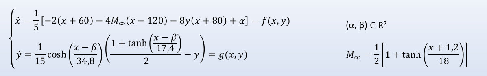
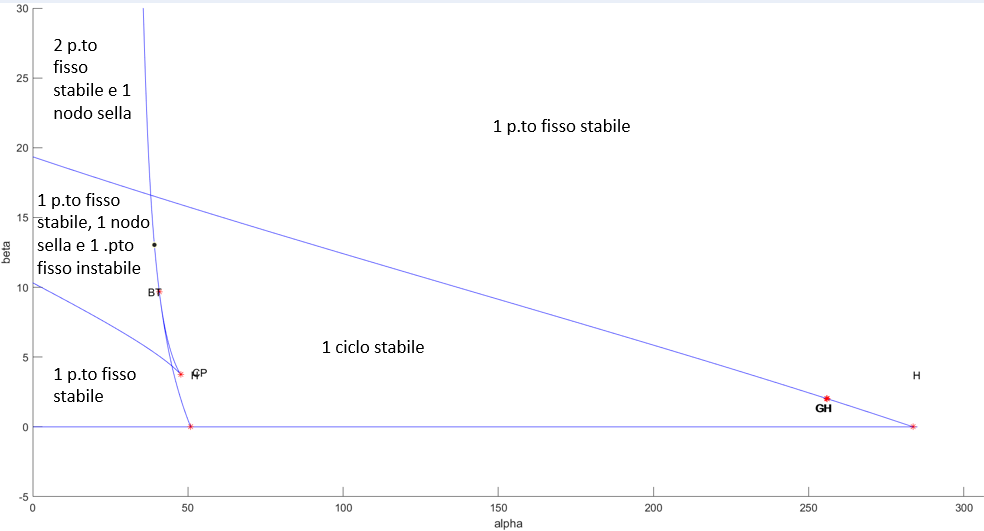

<b><h1>Analysis Non linear Dynamic system</h1></b>

Examination carried out in collaboration with Gianluca for the second year of the Master's programme.

The project was carried out using Matlab's MATCOM tool.

The aim of this project is to analyse a non-linear dynamic system. 

The following image shows how the system behaves when alpha and beta parameters are changed.

